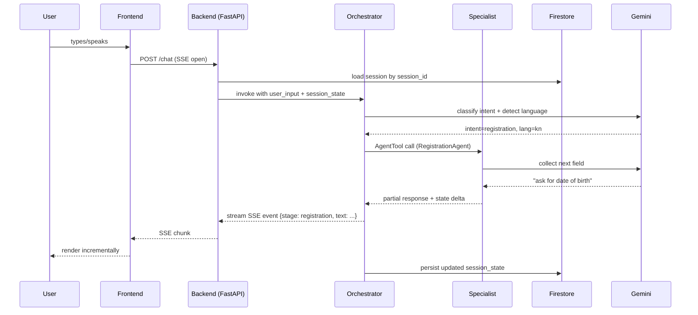

# Architecture

System design, data flow, and the reasoning behind each major choice.

---

## 1. The big picture

Sankalp is a single-region, serverless, multi-agent web application. Five Google ADK agents live inside one FastAPI process on Cloud Run. The frontend is a separate Cloud Run service running Next.js. Both share a Firestore database for session state and Cloud Storage for generated assets.

```
┌─────────────────────────────────────────────────────────────────────┐
│                          User (browser, mobile web)                  │
└──────────────────────────────┬──────────────────────────────────────┘
                               │ HTTPS, SSE
                               ▼
┌─────────────────────────────────────────────────────────────────────┐
│            frontend service  (Cloud Run, Next.js 14)                 │
│  ┌──────────────────────────────────────────────────────────────┐   │
│  │  Chat UI · Voice input · Camera capture · 3D constituency    │   │
│  └──────────────────────────────────────────────────────────────┘   │
└──────────────────────────────┬──────────────────────────────────────┘
                               │ HTTPS, SSE
                               ▼
┌─────────────────────────────────────────────────────────────────────┐
│            backend service  (Cloud Run, FastAPI + ADK)               │
│                                                                      │
│   ┌─────────────────────  OrchestratorAgent  ───────────────────┐   │
│   │                        Gemini 2.5 Flash                       │   │
│   │   tools: language_detect · session_state · 4 AgentTools       │   │
│   └─────┬──────────┬──────────────┬──────────────┬───────────────┘   │
│         ▼          ▼              ▼              ▼                    │
│   Registration  Verification    Booth          Story                  │
│     Agent          Agent        Agent          Agent                  │
│   (Flash)         (Flash)      (Flash)        (2.5 Pro)              │
│       │              │            │              │                    │
│       ▼              ▼            ▼              ▼                    │
│  form_validate  epic_search  maps_lookup   constituency_data          │
│  pdf_generate   dedup_check  accessibility imagen_cover               │
│                                                                       │
└──────────┬─────────────┬─────────────┬──────────────┬────────────────┘
           │             │             │              │
           ▼             ▼             ▼              ▼
      Firestore    Cloud Vision   Maps Platform   Cloud Storage
     (sessions)        (OCR)      (Places+Dir)    (story assets)
                                                       │
                                                       ▼
                                                Imagen 3 + Gemini TTS
```

## 2. Why this shape

Three constraints drove the architecture.

**Hackathon time budget.** Seven days, solo. Distributed services across multiple Cloud Run revisions would burn two days on plumbing alone. So: one backend service, one frontend service, one database. Pub/Sub fan-out (used in PingPen and Bruhworking) is overkill here.

**Cost discipline.** ADK's AgentTool pattern lets us use Gemini 2.5 Flash for routing and four of five specialists. Only StoryAgent needs Pro. This keeps a full demo session under $0.50 of Vertex AI spend.

**Demo reliability.** Cold starts kill demos. Cloud Run with min-instances=1 on backend, min-instances=0 on frontend (Next.js cold-starts gracefully). Cloud Run *service* region is asia-south1 for low-latency Maps and Firestore reads. **Vertex AI LLM calls route to us-central1**: gemini-2.5-pro (StoryAgent) is not yet provisioned in asia-south1, so we use us-central1 for all Gemini calls. The ~150 ms LLM round-trip overhead is invisible during streaming SSE output. `GOOGLE_CLOUD_LOCATION` controls this — see `backend/.env.example` and DEPLOYMENT.md §4.3.

## 3. The agent topology

Five agents, two tiers.

**Tier 1 — Orchestrator.** Sees every user turn. Detects language. Decides which specialist to call, or whether to answer directly (small talk, clarification). Holds no domain logic. Owned by Gemini 2.5 Flash because routing is a fast, cheap classification task.

**Tier 2 — Four specialists.**

| Agent | Owns | LLM | Why |
|---|---|---|---|
| RegistrationAgent | Form 6 (new voter) and Form 8 (corrections) conversational fill, PDF generation | Gemini 2.5 Flash | Slot-filling — fast, deterministic |
| VerificationAgent | EPIC search, duplicate detection, suggestion of corrections | Gemini 2.5 Flash | Database lookup wrapped in conversation |
| BoothAgent | Polling booth lookup, directions, accessibility metadata | Gemini 2.5 Flash | Map data + simple summarization |
| StoryAgent | Constituency historical narrative, optional Imagen cover | Gemini 2.5 Pro | Generative quality matters; this is the demo moment |

Specialists never call each other. If RegistrationAgent realises the user actually wants to verify an existing record, it returns control to Orchestrator with a hand-off intent. The Orchestrator then invokes VerificationAgent. This keeps state machine debugging tractable.

## 4. Request lifecycle



Every user turn produces a stream of SSE events tagged by `stage` (e.g. `lang_detect`, `routing`, `specialist:registration`, `final`). The frontend renders each stage with its own UI affordance (a colored chip, a typing indicator, a tool result card).

## 5. State and memory

Three layers of state. Treat them differently.

**Session state — Firestore, TTL 24h.**
Holds the current conversation: language, last intent, partially filled form fields, last booth lookup. Document ID is an opaque base64 session ID minted on first visit. No PII is stored — names and addresses live in transient form data only and are scrubbed before persistence.

```python
# backend/types/session.py (excerpt)
class SessionState(BaseModel):
    session_id: str
    language: Literal["en", "hi", "bn", "ta", "kn", "te", "mr"] = "en"
    last_intent: Optional[Literal["register", "verify", "booth", "story", "smalltalk"]]
    form_state: Optional[FormState] = None
    last_booth: Optional[BoothResult] = None
    last_story: Optional[StoryResult] = None
    created_at: datetime
    expires_at: datetime  # +24h
```

**Agent memory — in-process, single turn.**
ADK gives each agent a conversation buffer for the current turn only. We don't use ADK's long-term memory store — Firestore is the source of truth.

**Constituency data — in-memory at boot.**
The 100 representative constituencies live in `backend/data/constituencies.json`, loaded into a dict at startup. Cold start cost: under 50 ms. No Firestore reads on the StoryAgent path until cache miss.

## 6. Data flow for the four core journeys

### 6.1 New registration (Form 6)

```
user "I want to register"
  → Orchestrator: intent=register, lang=hi
    → RegistrationAgent: ask name → ask DOB → ask gender → ask address
                       → ask AC (auto-fill from PIN) → ask phone (optional)
                       → confirm → generate Form 6 PDF
      → tool: form6_pdf_generator (PyPDF2 + ECI Form 6 template)
        → Cloud Storage: store PDF at sessions/{sid}/form6.pdf
        → return signed URL (15 min TTL)
  → Frontend: render download card with QR to ECI portal
```

### 6.2 EPIC verification

```
user "check if I'm on the roll" or photo of EPIC card
  → Orchestrator: intent=verify
    → if photo: tool ocr_epic (Cloud Vision) → extract EPIC + name
    → VerificationAgent: tool epic_search (mock data layer)
      → result: found / not_found / multiple_matches
      → if found: summarize roll details, offer correction flow
      → if multiple: surface dedup warning
  → Frontend: render result card + correction CTA
```

### 6.3 Polling booth lookup

```
user "where do I vote?"
  → Orchestrator: intent=booth
    → BoothAgent: needs EPIC or PIN+address
      → tool maps_booth_lookup (mock data + Maps Geocoding)
      → tool directions (Maps Directions API, transit + walking)
      → tool accessibility_check (booth metadata: wheelchair, language assist)
  → Frontend: render Map embed + accessibility chips + ETA
```

### 6.4 Civic narrative (the demo moment)

```
user "why does my vote matter?"
  → Orchestrator: intent=story
    → StoryAgent (Gemini 2.5 Pro):
      → tool constituency_data (lookup by AC code)
      → tool turnout_history (last 5 elections)
      → tool win_margin_history
      → compose narrative prompt with retrieved facts
      → optional: tool imagen_cover (1 image, 1024x1024)
      → optional: tool tts_narrate (Gemini TTS, user's language)
      → store assets in Cloud Storage
  → Frontend: render story card with cover + audio + scrollable text
            + 3D constituency mini-map (React Three Fiber)
```

## 7. Multimodal ingress

| Modality | How | Where it lands |
|---|---|---|
| Text | Standard chat input | `POST /chat` with `{message, session_id}` |
| Voice | Gemini Live API session, browser captures audio | `POST /voice` with audio chunks; ADK transcribes + routes |
| Camera | `<input capture>` for EPIC scan | `POST /vision/epic` returns parsed fields, then funnels into VerificationAgent |
| PIN code | Geolocation or manual entry | Stored in `session_state.form_state.pincode`, used by BoothAgent + StoryAgent |

All four converge on the same Orchestrator. The Orchestrator sees a normalized text intent regardless of source modality.

## 8. Frontend architecture

Next.js 14 App Router. Three top-level routes.

```
app/
├── (chat)/
│   ├── page.tsx            ← chat UI, default landing
│   └── layout.tsx
├── story/
│   └── [ac_code]/page.tsx  ← shareable story permalink
├── about/
│   └── page.tsx            ← what Sankalp is, vertical disclosure
└── api/
    └── proxy/[...path]/route.ts  ← thin proxy to backend (handles SSE)
```

Components live in `components/`:

- `ChatStream` — consumes SSE, renders staged events
- `LanguageSelector` — top-bar dropdown, persists to `localStorage`
- `VoiceButton` — push-to-talk via Web Audio API, streams to `/voice`
- `EpicCamera` — `<input capture>` + preview + submit
- `BoothCard` — Map embed + directions + accessibility chips
- `StoryCanvas` — React Three Fiber constituency map + audio player
- `FormPdfCard` — download CTA + QR code

State is local to components. No Redux, no Zustand. The only shared state is `sessionId` in `localStorage`.

## 9. Backend architecture

```
backend/
├── main.py                  ← FastAPI app, route mounts, CORS
├── routes/
│   ├── chat.py              ← SSE endpoint
│   ├── voice.py             ← Gemini Live proxy
│   ├── vision.py            ← OCR endpoint
│   └── health.py          ← /api/healthz (bare /healthz reserved by GFE on *.run.app)
├── agents/
│   ├── orchestrator.py      ← root agent, AgentTool wiring
│   ├── registration.py
│   ├── verification.py
│   ├── booth.py
│   └── story.py
├── tools/
│   ├── language.py          ← detect_language tool
│   ├── session.py           ← session CRUD on Firestore
│   ├── form_pdf.py          ← Form 6/8 PDF generation
│   ├── epic_search.py       ← mock data lookup
│   ├── maps.py              ← Maps Platform calls
│   ├── ocr.py               ← Cloud Vision wrapper
│   ├── constituency.py      ← StoryAgent data tools
│   ├── imagen.py            ← Imagen cover generation
│   └── tts.py               ← Gemini TTS wrapper
├── data/
│   ├── constituencies.json  ← 100 ACs with full historical data
│   ├── electoral_roll.json  ← mock voter records (~5000)
│   └── booths.json          ← polling booth metadata
├── schemas/                  ← Pydantic v2 data contracts (renamed from `types/` to avoid stdlib collision)
│   ├── electoral.py          ← Constituency, ElectionRecord, VoterRecord, Booth, …
│   ├── session.py
│   ├── forms.py
│   └── agents.py
└── tests/
    ├── test_orchestrator.py
    ├── test_registration.py
    ├── test_story.py
    └── test_smoke.py
```

## 10. Security and privacy

**Boundary one — no real PII persistence.** EPIC numbers, names, addresses are held in Firestore session state but TTL'd to 24 hours and scrubbed of any field not strictly needed for the active flow. Logs strip PII via a structured-logging filter.

**Boundary two — secrets in Secret Manager.** No API keys in `.env` files committed to the repo. The Cloud Run service account has Secret Accessor role on three secrets: `GOOGLE_API_KEY`, `GOOGLE_MAPS_API_KEY`, `FIRESTORE_PROJECT_ID`.

**Boundary three — no form submission to ECI.** Sankalp generates pre-filled PDFs the user downloads and submits manually on voters.eci.gov.in. We do not automate the submit step. This is a deliberate trust boundary disclosed in the UI.

**Boundary four — no scraping.** voters.eci.gov.in is not hit programmatically. All constituency data comes from ECI's published statistical PDFs (statutory publications, not scraping).

**Boundary five — opaque session IDs.** Session IDs are 256-bit random tokens, not user IDs. No login, no email, no account. The hackathon demo is anonymous-by-default.

## 11. Observability

- **Cloud Logging** — structured JSON logs from FastAPI, one log line per agent invocation with `session_id`, `intent`, `latency_ms`, `tokens_in`, `tokens_out`.
- **Cost log** — every LLM call writes a `cost_log` document to Firestore for the demo dashboard. Aggregated to a `/admin/costs` page (gated by simple shared-secret query param for the judging session).
- **No third-party telemetry.** No Sentry, no Datadog. Cloud Logging + a Looker Studio dashboard built from BigQuery export is enough for hackathon evaluation.

## 12. Failure modes and graceful degradation

| Failure | What happens |
|---|---|
| Gemini API timeout | Frontend shows "let me try again" chip, retries once with exponential backoff, then surfaces a "try a different question" message |
| Firestore unavailable | Sessions fall back to in-memory dict (degraded; warns user that history won't persist) |
| Maps API quota hit | BoothAgent returns address-only result with a "tap here for directions" deeplink to `https://maps.google.com/?q=...` |
| Cloud Vision OCR fails | EpicCamera shows a manual-entry fallback form |
| Imagen quota hit | StoryAgent skips cover and returns text-only narrative |
| Cold start over 5s | Cloud Run min-instances=1 on backend prevents this for demo |

## 13. What's deliberately out of scope

- Authentication and user accounts (anonymous sessions only)
- Real form submission to ECI (we generate PDFs, user submits)
- Live electoral roll data (mock layer with disclosure)
- Postal ballot (Form 12) — would extend in v2
- WhatsApp Business API integration — would extend in v2
- Result tracking on counting day — out of vertical scope

These are real product features. They're deferred because hackathon scope must close at something demoable in seven days.

## 14. Open questions for the build

These are flagged so they don't get silently decided wrong.

1. **Does the StoryAgent narrate in audio by default, or only on user tap?** Default to text + optional audio tap — saves cost, faster first paint.
2. **Should the 3D constituency map render on mobile?** Yes, but degrade to a 2D static SVG below 380px viewport.
3. **What happens when a user's PIN doesn't map to one of the 100 mock constituencies?** Show an honest "this is a demo with 100 representative constituencies; here's a similar one" card and offer to walk through with that data.
4. **Single backend service or split?** Single, unless agent invocation latency becomes a problem in load test.

These questions get answered in the build phase with code, then back-filled into this doc.
